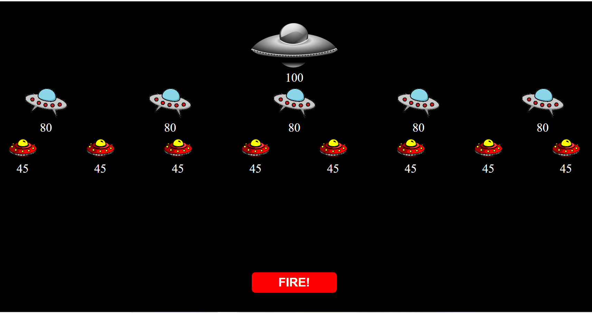
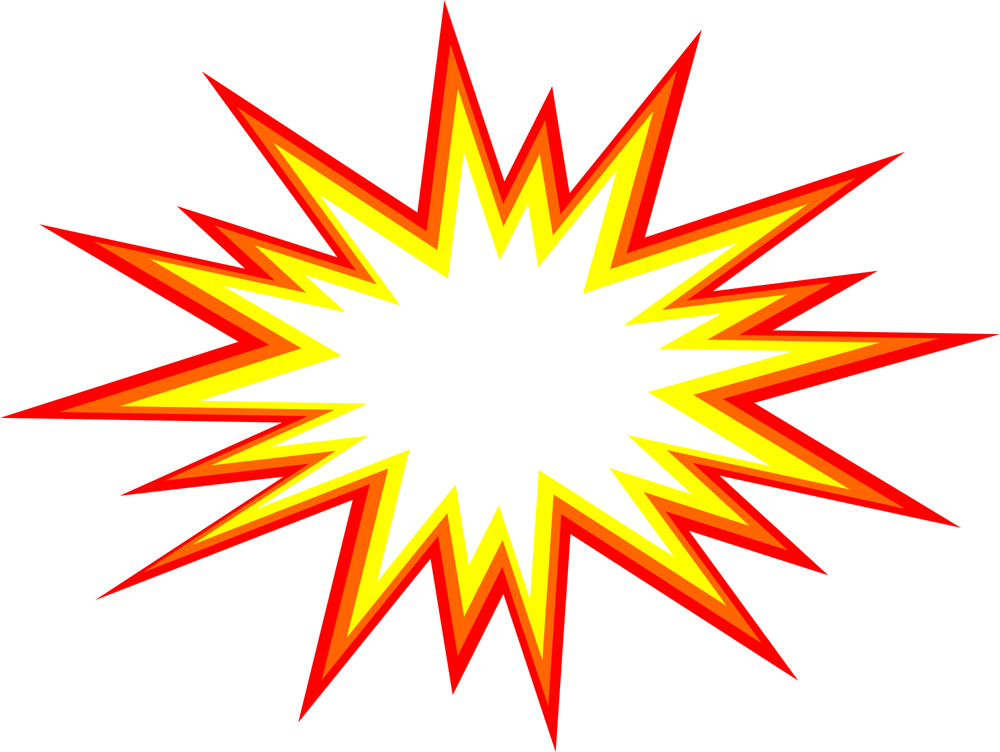

# Hostile Aliens

### A simple game based on Space Invaders. Built in Javascript with some basic HTML/SCSS, using an OOP approach.

#### Project Link [_here_](https://aimeejenner.github.io/hostile-aliens/).

<p align="center">
  
</p>

## Description

A simple game with a single button that hits a random alien ship in the fleet. Each time the button is pressed, a random alien ship is hit and its hit points are reduced. Once an alien ships points have hit zero the ship is destroyed and can’t be hit again. The game is over once all alien ships have been destroyed.

---

| Table of Contents               |
| ------------------------------- |
| [User Story](#UserStory)        |
| [Functionality](#Functionality) |
| [Technology](#Technology)       | 
| [Testing](#Testing)             |

---

## User Story

-   **As a player I want to click a button that hits a random alien ship, so that I can destroy all ships and complete the game**
-   Given that I click the 'Fire' button, a random alien ship should be hit.
-   Given that I hit the Mother ship, its hit points should be reduced by 9.
-   Given that I hit a Defence ship, its hit points should be reduced by 10.
-   Given that I hit an Attack ship, its hit points should be reduced by 12.
-   Given that I have destroyed the Mother ship, all ships should be destroyed.
-   Given that I have destroyed all alien ships, I should be able to start a new game.

## Functionality

The game has the following Alien ships:
-   1 Mother ship, which starts with 100 hit points
-   5 Defence ships, which each start with 80 hit points 
-   8 Attack ships, which each start with 45 hit points

The AlienShip class in alien-ship.js has properties for ship type, total hit points, points lost per hit, number of ships and ship image. It contains methods to generate an array of alien ships and to reduce a ship's hit points.

```js
/*
The AlienShip class contains methods to generate an array of ships and to reduce a ship's hit points
*/
class AlienShip {
    constructor(shipType, totalHitPoints, pointsLostPerHit, numberOfShips, shipImage) {
        this.shipType = shipType;
        this.totalHitPoints = totalHitPoints;
        this.pointsLostPerHit = pointsLostPerHit;
        this.numberOfShips = numberOfShips;
        this.shipImage = shipImage;
    }

    getShipsArr() {
        let shipsArr = [];
        for (let i = 0; i < this.numberOfShips; i++) {
            shipsArr[i] = new AlienShip(this.shipType, this.totalHitPoints, this.pointsLostPerHit, this.numberOfShips, this.shipImage);
        }
        return shipsArr;
    }

    reduceHitPoints() {
        return this.totalHitPoints -= this.pointsLostPerHit;
    }
}
```
The AlienShip class is imported into the script.js file, which contains the following functions:

-   The getAllShips function generates an array of all ships to start the game.
-   The displayShips function displays the ships array on the screen. This is run again each time a ship is hit to update the display.
-   The selectTarget function selects a random ship from the array and sets it as the target ship.

The key function in the game is hitTarget. This reduces the target ship's total hit points by the appropriate amount and removes the ship from the array if the points have reached zero.

```js
/*
The hitTarget function reduces the target ship's total hit points by pointsLostPerHit amount. If total hit points <= 0 ship is destroyed.
*/ 
const hitTarget = () => {
    let targetShip = selectTarget();
    let shipHit = targetShip.shipImage += "HIT!";
    setTimeout(() => {
        targetShip.shipImage = shipHit.replace("HIT!", "");
        displayShips();
      }, 300)
    targetShip.reduceHitPoints();
    if (targetShip.totalHitPoints <= 0) {
        let i = allShipsArr.indexOf(targetShip);
        if (i != -1) {
            targetShip.shipImage = '';
            targetShip.totalHitPoints = "";
            setTimeout(() => {
                allShipsArr.splice(i, 1);
                displayShips();
                gameOver();
              }, 500)
        }
    }
}
```
The game is over when there are no ships left in the ships array or when the Mother ship has been destroyed.

```js
/*
The gameOver function is run when all ships have been destroyed
*/ 
const gameOver = () => {
    if (allShipsArr === false || !allShipsArr.some(ship => ship.shipType === "Mother")) {
        shipsContainer.className = "intro";
        shipsContainer.innerHTML = "GAME OVER";
        inPlay = false;
        fireButton.innerHTML = "Restart Game";
    }
}
```
An event listener is attached to the 'Fire' button which runs the above functions when the button is clicked.


## Technology

-   Javascript
-   Sass
-   HTML5

## Testing

The alien-ship.test.js file contains tests which can be run to check that the AlienShip class is working correctly.